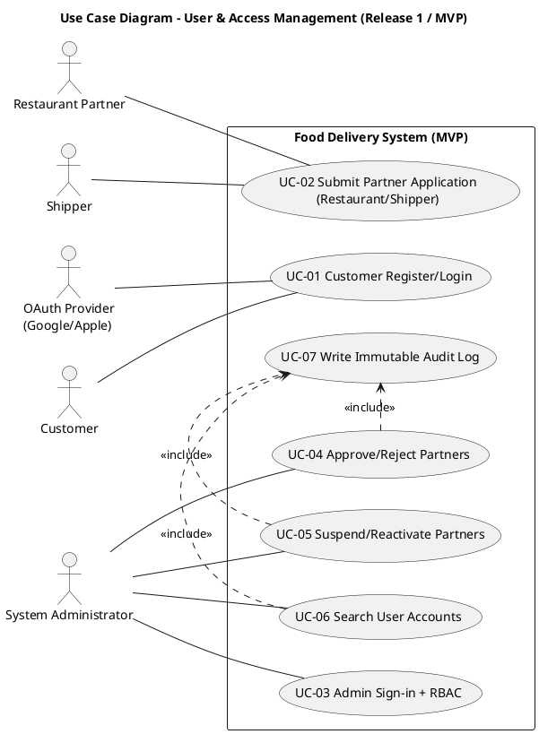
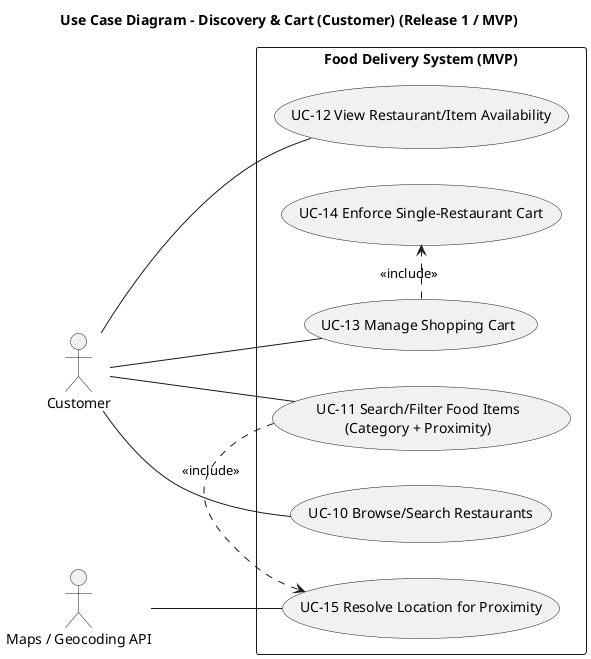
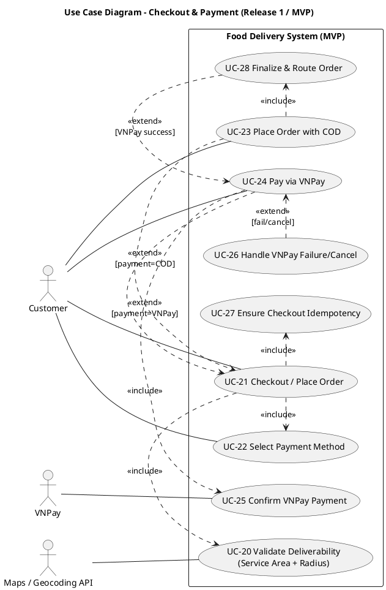
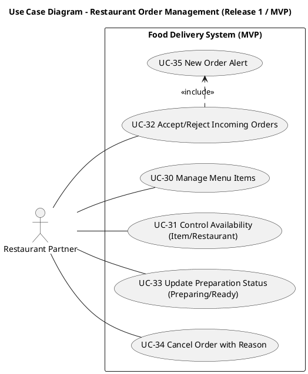
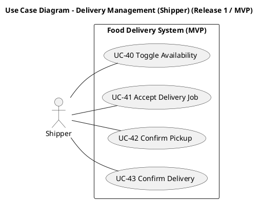
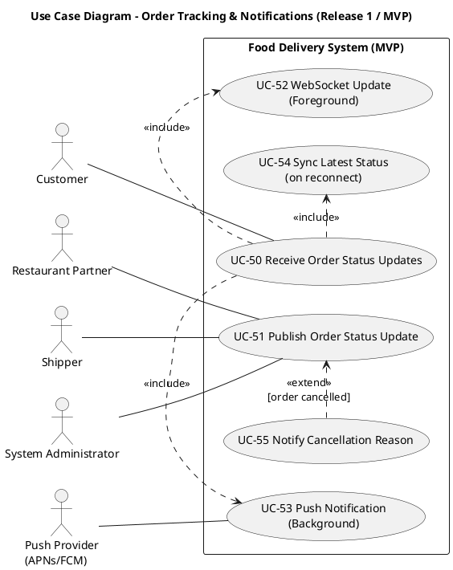
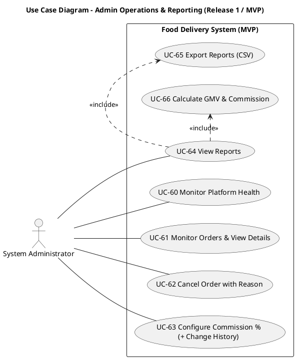

# Mô hình Use Case — Hệ thống Giao Đồ Ăn (Release 1 / MVP)

Version 1.0  
Ngày: 24/03/2026  
Nhóm thực hiện: Development Team

## Bảng ghi nhận thay đổi tài liệu

| Ngày | Phiên bản | Mô tả | Tác giả |
|---|---:|---|---|
| 24/03/2026 | 1.0 | Use case theo miền nghiệp vụ: sơ đồ, actor, danh sách use case, đặc tả MVP | Development Team |

---

# 1. Sơ đồ Use-case

> Mỗi sơ đồ tương ứng một **miền nghiệp vụ** (business domain). PlantUML blocks bên dưới là runnable (`@startuml` → `@enduml`).

## 1.1 Use-case Quản lý người dùng & truy cập

Nguồn `.puml`: `Documents/usecase-diagrams/01-user-access.puml`

## 1.2 Use-case Khám phá & giỏ hàng (Customer)

Nguồn `.puml`: `Documents/usecase-diagrams/02-discovery-cart.puml`

## 1.3 Use-case Checkout & thanh toán

Nguồn `.puml`: `Documents/usecase-diagrams/03-checkout-payment.puml`

## 1.4 Use-case Quản lý đơn hàng phía Nhà hàng

Nguồn `.puml`: `Documents/usecase-diagrams/04-restaurant-orders.puml`

## 1.5 Use-case Quản lý giao hàng (Shipper)

Nguồn `.puml`: `Documents/usecase-diagrams/05-delivery-shipper.puml`

## 1.6 Use-case Theo dõi đơn & thông báo

Nguồn `.puml`: `Documents/usecase-diagrams/06-tracking-notifications.puml`

## 1.7 Use-case Vận hành Admin & báo cáo

Nguồn `.puml`: `Documents/usecase-diagrams/07-admin-ops-reporting.puml`

---

# 2. Danh sách các Actor

| STT | Tên Actor | Ý nghĩa/Ghi chú |
|---:|---|---|
| 1 | Customer | Người đặt món: khám phá nhà hàng/món, quản lý giỏ, checkout, theo dõi đơn. |
| 2 | Restaurant Partner | Nhà hàng/nhân viên bếp: quản lý menu & availability, nhận và xử lý đơn. |
| 3 | Shipper | Nhân viên giao hàng: bật/tắt sẵn sàng, nhận job, pickup, delivered. |
| 4 | System Administrator | Vận hành hệ thống: duyệt đối tác, giám sát, can thiệp hủy đơn, cấu hình commission, báo cáo. |
| 5 | VNPay | Cổng thanh toán online; hệ thống chỉ finalize/routing sau khi nhận xác nhận thành công (BR-4). |
| 6 | OAuth Provider (Google/Apple) | Xác thực đăng nhập OAuth cho luồng đăng ký/đăng nhập (SRS FR-1.1). |
| 7 | Maps/Geocoding API | Geocoding và tính toán khoảng cách: proximity search + kiểm tra bán kính + service area (Vision dependencies). |
| 8 | Push Provider (APNs/FCM) | Gửi push notification khi ứng dụng nền/đóng (SRS FR-2.3). |

---

# 3. Danh sách các Use-case

| STT | Use Case ID | Tên Use Case | Miền nghiệp vụ | Actor chính |
|---:|---|---|---|---|
| 1 | UC-01 | Customer Register/Login | User & Access | Customer; OAuth Provider |
| 2 | UC-02 | Submit Partner Application (Restaurant/Shipper) | User & Access | Restaurant Partner; Shipper |
| 3 | UC-03 | Admin Sign-in + RBAC | User & Access | System Administrator |
| 4 | UC-04 | Approve/Reject Partners | User & Access | System Administrator |
| 5 | UC-05 | Suspend/Reactivate Partners | User & Access | System Administrator |
| 6 | UC-06 | Search User Accounts | User & Access | System Administrator |
| 7 | UC-07 | Write Immutable Audit Log | User & Access | System |
| 8 | UC-10 | Browse/Search Restaurants | Discovery & Cart | Customer |
| 9 | UC-11 | Search/Filter Food Items (Category + Proximity) | Discovery & Cart | Customer; Maps/Geocoding API |
| 10 | UC-12 | View Restaurant/Item Availability | Discovery & Cart | Customer |
| 11 | UC-13 | Manage Shopping Cart | Discovery & Cart | Customer |
| 12 | UC-14 | Enforce Single-Restaurant Cart | Discovery & Cart | System |
| 13 | UC-15 | Resolve Location for Proximity | Discovery & Cart | Maps/Geocoding API |
| 14 | UC-20 | Validate Deliverability (Service Area + Radius) | Checkout & Payment | Customer; Maps/Geocoding API |
| 15 | UC-21 | Checkout / Place Order | Checkout & Payment | Customer |
| 16 | UC-22 | Select Payment Method | Checkout & Payment | Customer |
| 17 | UC-23 | Place Order with COD | Checkout & Payment | Customer |
| 18 | UC-24 | Pay via VNPay | Checkout & Payment | Customer; VNPay |
| 19 | UC-25 | Confirm VNPay Payment | Checkout & Payment | VNPay |
| 20 | UC-26 | Handle VNPay Failure/Cancel | Checkout & Payment | Customer |
| 21 | UC-27 | Ensure Checkout Idempotency | Checkout & Payment | System |
| 22 | UC-28 | Finalize & Route Order | Checkout & Payment | System |
| 23 | UC-30 | Manage Menu Items | Restaurant Orders | Restaurant Partner |
| 24 | UC-31 | Control Availability (Item/Restaurant) | Restaurant Orders | Restaurant Partner |
| 25 | UC-32 | Accept/Reject Incoming Orders | Restaurant Orders | Restaurant Partner |
| 26 | UC-33 | Update Preparation Status | Restaurant Orders | Restaurant Partner |
| 27 | UC-34 | Cancel Order with Reason | Restaurant Orders | Restaurant Partner |
| 28 | UC-35 | New Order Alert | Restaurant Orders | Restaurant Partner |
| 29 | UC-40 | Toggle Availability | Delivery | Shipper |
| 30 | UC-41 | Accept Delivery Job | Delivery | Shipper |
| 31 | UC-42 | Confirm Pickup | Delivery | Shipper |
| 32 | UC-43 | Confirm Delivery | Delivery | Shipper |
| 33 | UC-50 | Receive Order Status Updates | Tracking & Notifications | Customer |
| 34 | UC-51 | Publish Order Status Update | Tracking & Notifications | Restaurant Partner; Shipper; Admin |
| 35 | UC-52 | WebSocket Update (Foreground) | Tracking & Notifications | System |
| 36 | UC-53 | Push Notification (Background) | Tracking & Notifications | Push Provider |
| 37 | UC-54 | Sync Latest Status (on reconnect) | Tracking & Notifications | Customer |
| 38 | UC-55 | Notify Cancellation Reason | Tracking & Notifications | System |
| 39 | UC-60 | Monitor Platform Health | Admin Ops | System Administrator |
| 40 | UC-61 | Monitor Orders & View Details | Admin Ops | System Administrator |
| 41 | UC-62 | Cancel Order with Reason | Admin Ops | System Administrator |
| 42 | UC-63 | Configure Commission % (+ History) | Admin Ops | System Administrator |
| 43 | UC-64 | View Reports | Admin Ops | System Administrator |
| 44 | UC-65 | Export Reports (CSV) | Admin Ops | System Administrator |
| 45 | UC-66 | Calculate GMV & Commission | Admin Ops | System |

---

# 4. Đặc tả Use-case

Ghi chú chung (áp dụng cho nhiều use case):
- BR-2: Giỏ hàng chỉ chứa món của 1 nhà hàng.
- BR-3: Địa chỉ giao phải nằm trong bán kính phục vụ nhà hàng.
- BR-4: VNPay thành công mới được finalize/routing đơn.
- BR-6: MVP chỉ hoạt động trong một service area.
- BR-7: Trạng thái đơn phải đi theo chuỗi hợp lệ.
- FR-2.3/FR-2.4: Push notification và hiển thị lý do hủy.

Dưới đây là đặc tả cho từng Use Case trong danh sách ở Mục 3.

## UC-01 — Customer Register/Login

|  |  |
|---|---|
| Use Case ID | UC-01 |
| Tên Use Case | Customer Register/Login |
| Actor | Customer; OAuth Provider (Google/Apple) |
| Mô tả | Đăng ký/đăng nhập Customer để sử dụng app (FR-1.1). |
| Preconditions | Có kết nối mạng; hệ thống auth hoạt động. |
| Postconditions | Customer có session hợp lệ hoặc nhận lỗi an toàn. |
| Priority | Cao |
| Frequency | Hàng ngày |
| Normal Flow | 1) Customer chọn đăng ký/đăng nhập. 2) Nhập thông tin hoặc chọn OAuth. 3) Hệ thống xác thực. 4) Tạo/khôi phục profile. 5) Trả kết quả thành công. |
| Alternative Flow | A1) Sai thông tin → từ chối, hiển thị lỗi không lộ thông tin nhạy cảm. |
| Exceptions | E1) Auth service unavailable → lỗi retry, app không crash. |
| Includes | OAuth verification (nếu chọn OAuth) |
| Extends | Không |
| Special Requirements | Bảo mật thông tin; không log dữ liệu nhạy cảm. |

## UC-02 — Submit Partner Application (Restaurant/Shipper)

|  |  |
|---|---|
| Use Case ID | UC-02 |
| Tên Use Case | Submit Partner Application (Restaurant/Shipper) |
| Actor | Restaurant Partner; Shipper |
| Mô tả | Gửi hồ sơ đăng ký để chờ Admin duyệt (BR-1). |
| Preconditions | Partner chưa active; có kết nối mạng. |
| Postconditions | Hồ sơ được lưu trạng thái `Pending Approval`. |
| Priority | Cao |
| Frequency | Thỉnh thoảng |
| Normal Flow | 1) Partner mở form đăng ký. 2) Nhập thông tin. 3) Hệ thống validate. 4) Lưu hồ sơ pending. |
| Alternative Flow | A1) Thiếu/không hợp lệ → hiển thị lỗi theo field. |
| Exceptions | E1) Lỗi lưu/kết nối → không tạo hồ sơ; hiển thị retry. |
| Includes | Validate application data |
| Extends | Không |
| Special Requirements | Hồ sơ phải xuất hiện trong queue duyệt của Admin. |

## UC-03 — Admin Sign-in + RBAC

|  |  |
|---|---|
| Use Case ID | UC-03 |
| Tên Use Case | Admin Sign-in + RBAC |
| Actor | System Administrator |
| Mô tả | Đăng nhập dashboard và enforce RBAC cho các thao tác quản trị (FR-4.1, FR-4.2). |
| Preconditions | Admin có tài khoản hợp lệ. |
| Postconditions | Admin truy cập được chức năng đúng quyền; hành vi trái quyền bị chặn. |
| Priority | Cao |
| Frequency | Hàng ngày |
| Normal Flow | 1) Admin truy cập dashboard. 2) Xác thực. 3) Hệ thống nạp quyền. 4) Admin thao tác trong phạm vi cho phép. |
| Alternative Flow | A1) Thất bại xác thực → từ chối. |
| Exceptions | E1) Lỗi auth → lỗi retry. |
| Includes | RBAC check per action |
| Extends | Không |
| Special Requirements | Log các lần bị từ chối quyền để điều tra. |

## UC-04 — Approve/Reject Partners

|  |  |
|---|---|
| Use Case ID | UC-04 |
| Tên Use Case | Approve/Reject Partners |
| Actor | System Administrator |
| Mô tả | Duyệt/từ chối đăng ký Restaurant/Shipper (BR-1; FR-4.4..FR-4.7). |
| Preconditions | Admin đã đăng nhập; có hồ sơ pending. |
| Postconditions | Trạng thái partner = Approved/Rejected; lý do reject được lưu. |
| Priority | Cao |
| Frequency | Hàng ngày |
| Normal Flow | 1) Admin mở queue pending. 2) Chọn hồ sơ. 3) Approve hoặc Reject. 4) Nếu Reject nhập lý do. 5) Hệ thống lưu và cập nhật trạng thái. |
| Alternative Flow | A1) Không đủ quyền → từ chối. |
| Exceptions | E1) Lỗi lưu → không đổi trạng thái, hiển thị lỗi. |
| Includes | UC-07 Write Immutable Audit Log |
| Extends | Không |
| Special Requirements | Lý do reject bắt buộc. |

## UC-05 — Suspend/Reactivate Partners

|  |  |
|---|---|
| Use Case ID | UC-05 |
| Tên Use Case | Suspend/Reactivate Partners |
| Actor | System Administrator |
| Mô tả | Tạm khóa/mở lại partner để ngăn vận hành khi vi phạm (FR-4.8, FR-4.9). |
| Preconditions | Admin đã đăng nhập; partner tồn tại. |
| Postconditions | Partner `Suspended` hoặc `Active` tương ứng; enforcement áp dụng lên nhận/xử lý đơn. |
| Priority | Trung bình |
| Frequency | Thỉnh thoảng |
| Normal Flow | 1) Admin tìm partner. 2) Chọn Suspend/Reactivate. 3) Nếu Suspend nhập lý do. 4) Hệ thống lưu trạng thái và áp chính sách. |
| Alternative Flow | A1) Không đủ quyền → từ chối. |
| Exceptions | E1) Lỗi lưu → không đổi trạng thái. |
| Includes | UC-07 Write Immutable Audit Log |
| Extends | Không |
| Special Requirements | Lý do suspend bắt buộc; áp dụng chặn nhận đơn mới. |

## UC-06 — Search User Accounts

|  |  |
|---|---|
| Use Case ID | UC-06 |
| Tên Use Case | Search User Accounts |
| Actor | System Administrator |
| Mô tả | Tìm/lọc user theo role và status (FR-4.3). |
| Preconditions | Admin đã đăng nhập. |
| Postconditions | Danh sách trả về đúng theo filter/search. |
| Priority | Trung bình |
| Frequency | Hàng ngày |
| Normal Flow | 1) Admin mở User Management. 2) Chọn filter role/status. 3) Hệ thống truy vấn và trả kết quả. 4) Admin mở chi tiết user. |
| Alternative Flow | A1) Không có kết quả → hiển thị rỗng. |
| Exceptions | E1) Lỗi truy vấn → hiển thị retry. |
| Includes | UC-07 Write Immutable Audit Log |
| Extends | Không |

## UC-07 — Write Immutable Audit Log

|  |  |
|---|---|
| Use Case ID | UC-07 |
| Tên Use Case | Write Immutable Audit Log |
| Actor | System |
| Mô tả | Ghi audit log bất biến cho hành động quản trị (FR-4.16; US-32). |
| Preconditions | Có hành động admin cần ghi log. |
| Postconditions | Audit entry được lưu với actor, action type, target, timestamp, before/after (nếu có). |
| Priority | Trung bình |
| Frequency | Phụ thuộc thao tác admin |
| Normal Flow | 1) Admin action được thực hiện. 2) Hệ thống tạo audit entry. 3) Lưu vào kho audit (append-only). |
| Alternative Flow | A1) Chính sách “block hoặc retry” khi ghi log thất bại. |
| Exceptions | E1) Không ghi được log → xử lý theo policy nhất quán (US-32). |
| Includes | Không |
| Extends | Không |
| Special Requirements | Không cho sửa/xóa audit entry; có filter theo time range/action type. |

## UC-10 — Browse/Search Restaurants

|  |  |
|---|---|
| Use Case ID | UC-10 |
| Tên Use Case | Browse/Search Restaurants |
| Actor | Customer |
| Mô tả | Xem danh sách nhà hàng và tìm theo tên/category/proximity (FR-1.2; US-2). |
| Preconditions | Có dữ liệu nhà hàng active. |
| Postconditions | Danh sách kết quả hiển thị; mở được chi tiết nhà hàng. |
| Priority | Cao |
| Frequency | Hàng ngày |
| Normal Flow | 1) Customer mở danh sách. 2) Hệ thống tải trang đầu. 3) Customer nhập query/chọn filter. 4) Hệ thống trả kết quả. |
| Alternative Flow | A1) Catalog lớn → phân trang/continuous loading. |
| Exceptions | E1) Lỗi tải dữ liệu → retry. |

## UC-11 — Search/Filter Food Items (Category + Proximity)

|  |  |
|---|---|
| Use Case ID | UC-11 |
| Tên Use Case | Search/Filter Food Items (Category + Proximity) |
| Actor | Customer; Maps/Geocoding API |
| Mô tả | Tìm món theo keyword/category và lọc theo khoảng cách phục vụ (US-3; BR-3). |
| Preconditions | Có vị trí (GPS hoặc địa chỉ). |
| Postconditions | Danh sách món phù hợp + có thể giao tới vị trí. |
| Priority | Trung bình |
| Frequency | Hàng ngày |
| Normal Flow | 1) Customer mở item search. 2) Hệ thống gọi UC-15 để lấy tọa độ. 3) Customer nhập keyword/chọn category. 4) Hệ thống trả kết quả và hiển thị nhà hàng/giá/khoảng cách. |
| Alternative Flow | A1) Không có quyền GPS → yêu cầu nhập địa chỉ. |
| Exceptions | E1) Map/geocode lỗi → retry; không trả kết quả proximity sai. |
| Includes | UC-15 Resolve Location for Proximity |

## UC-12 — View Restaurant/Item Availability

|  |  |
|---|---|
| Use Case ID | UC-12 |
| Tên Use Case | View Restaurant/Item Availability |
| Actor | Customer |
| Mô tả | Hiển thị trạng thái Closed/Sold Out để tránh đặt nhầm (BR-8; US-4). |
| Preconditions | Menu/availability đã được nhà hàng cập nhật. |
| Postconditions | Customer thấy rõ item/restaurant unavailable và bị chặn add-to-cart. |
| Priority | Cao |
| Frequency | Hàng ngày |
| Normal Flow | 1) Customer mở nhà hàng/menu. 2) Hệ thống hiển thị trạng thái availability. 3) Nếu sold out/closed, khóa thao tác tương ứng. |
| Alternative Flow | A1) Availability thay đổi khi đang xem → UI cập nhật trong cửa sổ mục tiêu (US-4). |
| Exceptions | E1) Lỗi tải availability → retry. |

## UC-13 — Manage Shopping Cart

|  |  |
|---|---|
| Use Case ID | UC-13 |
| Tên Use Case | Manage Shopping Cart |
| Actor | Customer |
| Mô tả | Thêm/xóa/sửa số lượng món trong giỏ (US-22). |
| Preconditions | Customer đang xem menu hợp lệ. |
| Postconditions | Giỏ hàng cập nhật đúng; tổng tiền nhất quán. |
| Priority | Cao |
| Frequency | Hàng ngày |
| Normal Flow | 1) Add món vào giỏ. 2) Hệ thống cập nhật tổng. 3) Customer thay đổi số lượng/xóa món. 4) Hệ thống cập nhật ngay. |
| Alternative Flow | A1) Khôi phục giỏ sau khi mở lại app trong “persistence window” (US-22). |
| Exceptions | E1) Lỗi lưu giỏ → retry. |
| Includes | UC-14 Enforce Single-Restaurant Cart |

## UC-14 — Enforce Single-Restaurant Cart

|  |  |
|---|---|
| Use Case ID | UC-14 |
| Tên Use Case | Enforce Single-Restaurant Cart |
| Actor | System |
| Mô tả | Chặn thêm món từ nhà hàng khác vào cùng giỏ (BR-2; US-5). |
| Preconditions | Giỏ đã có món của nhà hàng A. |
| Postconditions | Nếu thêm món nhà hàng B → bị chặn và hiển thị lựa chọn (clear/cancel). |
| Priority | Cao |
| Frequency | Phụ thuộc hành vi user |
| Normal Flow | 1) Customer chọn món nhà hàng khác. 2) Hệ thống phát hiện xung đột. 3) Hiển thị lựa chọn clear cart hoặc cancel. |
| Alternative Flow | A1) Customer chọn clear cart → giỏ trống và cho phép thêm mới. |
| Exceptions | Không |

## UC-15 — Resolve Location for Proximity

|  |  |
|---|---|
| Use Case ID | UC-15 |
| Tên Use Case | Resolve Location for Proximity |
| Actor | Maps/Geocoding API |
| Mô tả | Chuyển GPS hoặc địa chỉ thành tọa độ phục vụ lọc proximity. |
| Preconditions | Có GPS permission hoặc địa chỉ nhập tay. |
| Postconditions | Trả về tọa độ hợp lệ hoặc lỗi để UI xử lý. |
| Priority | Trung bình |
| Frequency | Hàng ngày |
| Normal Flow | 1) App yêu cầu vị trí. 2) Nếu GPS → lấy tọa độ. 3) Nếu địa chỉ → geocode. 4) Trả kết quả cho UC-11. |
| Alternative Flow | A1) Không có permission → yêu cầu nhập địa chỉ. |
| Exceptions | E1) Provider unavailable/quota → lỗi retry. |

## UC-20 — Validate Deliverability (Service Area + Radius)

|  |  |
|---|---|
| Use Case ID | UC-20 |
| Tên Use Case | Validate Deliverability (Service Area + Radius) |
| Actor | Customer; Maps/Geocoding API |
| Mô tả | Kiểm tra service area (BR-6) + bán kính giao (BR-3) trước khi đặt đơn (US-6; US-20). |
| Preconditions | Customer có địa chỉ; nhà hàng có radius. |
| Postconditions | Pass → cho checkout; Fail → chặn kèm lý do. |
| Priority | Cao |
| Frequency | Hàng ngày |
| Normal Flow | 1) Customer nhập địa chỉ. 2) Hệ thống geocode. 3) Check thuộc service area. 4) Tính khoảng cách đến nhà hàng và so radius. 5) Trả kết quả. |
| Alternative Flow | A1) Cache kết quả trong thời gian ngắn để giảm gọi API. |
| Exceptions | E1) Map/geocode lỗi → chặn đặt đơn, retry. |

## UC-21 — Checkout / Place Order

|  |  |
|---|---|
| Use Case ID | UC-21 |
| Tên Use Case | Checkout / Place Order |
| Actor | Customer |
| Mô tả | Checkout tạo đơn với COD/VNPay, có idempotency, và tuân BR-4 (US-7). |
| Preconditions | Giỏ hợp lệ (1 nhà hàng); địa chỉ giao hợp lệ. |
| Postconditions | COD: finalize/routing ngay; VNPay: finalize/routing sau confirm; thất bại: không routing. |
| Priority | Cao |
| Frequency | Hàng ngày |
| Normal Flow | 1) Customer mở checkout. 2) UC-20 validate. 3) UC-22 chọn payment. 4) UC-27 idempotency. 5) Tùy payment: UC-23 hoặc UC-24. |
| Alternative Flow | A1) Retry với cùng idempotency key trong TTL → trả về cùng order ID. |
| Exceptions | E1) Deliverability fail → chặn và hiển thị lý do. |
| Includes | UC-20; UC-22; UC-27 |

## UC-22 — Select Payment Method

|  |  |
|---|---|
| Use Case ID | UC-22 |
| Tên Use Case | Select Payment Method |
| Actor | Customer |
| Mô tả | Customer chọn COD hoặc VNPay (BR-4; FR-1.4). |
| Preconditions | Customer đang ở checkout. |
| Postconditions | Hệ thống ghi nhận lựa chọn và điều hướng luồng tương ứng. |
| Priority | Cao |
| Frequency | Hàng ngày |
| Normal Flow | 1) Hiển thị COD/VNPay. 2) Customer chọn 1. 3) Hệ thống lưu lựa chọn. |
| Exceptions | Không |

## UC-23 — Place Order with COD

|  |  |
|---|---|
| Use Case ID | UC-23 |
| Tên Use Case | Place Order with COD |
| Actor | Customer |
| Mô tả | Tạo đơn COD và finalize/routing ngay (BR-4). |
| Preconditions | UC-21 đã hoàn thành bước validate + idempotency. |
| Postconditions | Order được finalize và routed tới nhà hàng với trạng thái ban đầu hợp lệ. |
| Priority | Cao |
| Frequency | Hàng ngày |
| Normal Flow | 1) Customer xác nhận đặt COD. 2) Hệ thống tạo order record. 3) UC-28 finalize/routing. |
| Exceptions | E1) Lỗi tạo order → retry; tránh tạo trùng (idempotency). |
| Includes | UC-28 Finalize & Route Order |

## UC-24 — Pay via VNPay

|  |  |
|---|---|
| Use Case ID | UC-24 |
| Tên Use Case | Pay via VNPay |
| Actor | Customer; VNPay |
| Mô tả | Thực hiện thanh toán online qua VNPay; chỉ finalize/routing khi confirm thành công (BR-4). |
| Preconditions | Customer chọn VNPay; hệ thống tạo phiên thanh toán. |
| Postconditions | Success → UC-28; Fail/Cancel → UC-26; không routing nếu không success. |
| Priority | Cao |
| Frequency | Hàng ngày |
| Normal Flow | 1) Hệ thống khởi tạo yêu cầu VNPay. 2) Customer hoàn tất thanh toán. 3) VNPay callback/return. 4) UC-25 confirm. 5) Nếu success → UC-28 (extend). |
| Alternative Flow | A1) Customer hủy → UC-26 (extend). |
| Exceptions | E1) Callback không hợp lệ → coi như fail, không routing. |
| Includes | UC-25 Confirm VNPay Payment |

## UC-25 — Confirm VNPay Payment

|  |  |
|---|---|
| Use Case ID | UC-25 |
| Tên Use Case | Confirm VNPay Payment |
| Actor | VNPay |
| Mô tả | Xác nhận kết quả thanh toán từ VNPay theo callback/redirect và đối soát. |
| Preconditions | Hệ thống nhận callback/return từ VNPay. |
| Postconditions | Payment status được xác định (success/fail/cancel). |
| Priority | Cao |
| Frequency | Theo giao dịch |
| Normal Flow | 1) Nhận callback. 2) Verify chữ ký/tham số. 3) Ghi nhận kết quả. |
| Exceptions | E1) Verify fail → payment fail, không finalize/routing. |

## UC-26 — Handle VNPay Failure/Cancel

|  |  |
|---|---|
| Use Case ID | UC-26 |
| Tên Use Case | Handle VNPay Failure/Cancel |
| Actor | Customer |
| Mô tả | Hiển thị trạng thái thất bại/hủy thanh toán và cho retry; đơn không được routing (BR-4; US-7). |
| Preconditions | UC-24 thanh toán fail/cancel. |
| Postconditions | Customer thấy trạng thái rõ ràng và có thể retry thanh toán/checkout. |
| Priority | Cao |
| Frequency | Theo lỗi |
| Normal Flow | 1) Hệ thống nhận trạng thái fail/cancel. 2) Đánh dấu trạng thái phù hợp. 3) Hiển thị màn hình thất bại/hủy với lựa chọn retry. |
| Exceptions | Không |

## UC-27 — Ensure Checkout Idempotency

|  |  |
|---|---|
| Use Case ID | UC-27 |
| Tên Use Case | Ensure Checkout Idempotency |
| Actor | System |
| Mô tả | Chống tạo đơn trùng khi retry checkout (US-7). |
| Preconditions | Client gửi idempotency key. |
| Postconditions | Cùng key trong TTL → trả cùng order ID; không tạo duplicate. |
| Priority | Cao |
| Frequency | Theo retry |
| Normal Flow | 1) Nhận request + key. 2) Check key trong TTL. 3) Nếu đã tồn tại → trả kết quả cũ; nếu chưa → tiếp tục tạo mới và lưu mapping. |
| Exceptions | E1) Store idempotency lỗi → xử lý theo chính sách (an toàn). |

## UC-28 — Finalize & Route Order

|  |  |
|---|---|
| Use Case ID | UC-28 |
| Tên Use Case | Finalize & Route Order |
| Actor | System |
| Mô tả | Finalize order và route tới nhà hàng; với VNPay chỉ chạy khi payment success (BR-4). |
| Preconditions | Order hợp lệ (COD hoặc VNPay success). |
| Postconditions | Nhà hàng nhận đơn; order sẵn sàng vào lifecycle `Pending` → … |
| Priority | Cao |
| Frequency | Theo đơn |
| Normal Flow | 1) Lock/finalize order. 2) Gán trạng thái ban đầu. 3) Route đến nhà hàng. 4) Kích hoạt cơ chế alert/notify. |
| Exceptions | E1) Route thất bại → retry/queue theo thiết kế. |

## UC-30 — Manage Menu Items

|  |  |
|---|---|
| Use Case ID | UC-30 |
| Tên Use Case | Manage Menu Items |
| Actor | Restaurant Partner |
| Mô tả | Thêm/sửa/xóa/cập nhật món và giá (FR-3.1; US-11). |
| Preconditions | Partner đã approved và đăng nhập portal. |
| Postconditions | Menu cập nhật và hiển thị cho Customer trong cửa sổ đồng bộ mục tiêu. |
| Priority | Cao |
| Frequency | Hàng ngày |
| Normal Flow | 1) Mở quản lý menu. 2) Thêm/sửa thông tin. 3) Validate dữ liệu (giá không âm…). 4) Lưu và publish thay đổi. |
| Exceptions | E1) Validate fail → báo lỗi; E2) Lỗi lưu → retry. |

## UC-31 — Control Availability (Item/Restaurant)

|  |  |
|---|---|
| Use Case ID | UC-31 |
| Tên Use Case | Control Availability (Item/Restaurant) |
| Actor | Restaurant Partner |
| Mô tả | Toggle sold out/closed để chặn đơn mới ngay (BR-8; FR-3.2; US-12). |
| Preconditions | Partner đăng nhập; item/restaurant tồn tại. |
| Postconditions | Customer không add-to-cart/checkout với item/restaurant unavailable. |
| Priority | Cao |
| Frequency | Hàng ngày |
| Normal Flow | 1) Partner toggle trạng thái. 2) Hệ thống lưu. 3) Đồng bộ trạng thái ra client. |
| Exceptions | E1) Lỗi lưu → retry; trạng thái không thay đổi. |

## UC-32 — Accept/Reject Incoming Orders

|  |  |
|---|---|
| Use Case ID | UC-32 |
| Tên Use Case | Accept/Reject Incoming Orders |
| Actor | Restaurant Partner |
| Mô tả | Nhà hàng nhận đơn mới, accept/reject; có timeout hết hạn (FR-3.3; US-13). |
| Preconditions | Order đã được UC-28 route đến nhà hàng. |
| Postconditions | Accept → `Accepted`; Reject/timeout → trạng thái tương ứng và Customer được thông báo. |
| Priority | Cao |
| Frequency | Hàng ngày |
| Normal Flow | 1) UC-35 alert. 2) Partner mở chi tiết đơn. 3) Accept hoặc Reject. 4) Hệ thống validate transition theo BR-7 và lưu. |
| Alternative Flow | A1) Quá timeout → hệ thống đánh dấu expired/unaccepted và thông báo. |
| Exceptions | E1) Lỗi cập nhật → retry; không đổi trạng thái. |
| Includes | UC-35 New Order Alert |

## UC-33 — Update Preparation Status

|  |  |
|---|---|
| Use Case ID | UC-33 |
| Tên Use Case | Update Preparation Status |
| Actor | Restaurant Partner |
| Mô tả | Cập nhật Preparing/Ready for Pickup, tuân BR-7 (FR-3.4; US-23). |
| Preconditions | Order đã `Accepted`. |
| Postconditions | Trạng thái được cập nhật và publish cho Customer/Shipper. |
| Priority | Trung bình |
| Frequency | Hàng ngày |
| Normal Flow | 1) Partner chọn order. 2) Mark Preparing hoặc Ready. 3) Hệ thống kiểm tra chuỗi trạng thái hợp lệ. 4) Lưu và publish update. |
| Exceptions | E1) Out-of-sequence → từ chối và hiển thị lý do. |

## UC-34 — Cancel Order with Reason (Restaurant)

|  |  |
|---|---|
| Use Case ID | UC-34 |
| Tên Use Case | Cancel Order with Reason |
| Actor | Restaurant Partner |
| Mô tả | Hủy đơn trước pickup, bắt buộc lý do; Customer thấy lý do (FR-2.4; US-24). |
| Preconditions | Order chưa `Picked Up`. |
| Postconditions | Order = Canceled; lý do + actor + timestamp được lưu; thông báo được gửi. |
| Priority | Trung bình |
| Frequency | Thỉnh thoảng |
| Normal Flow | 1) Partner chọn hủy đơn. 2) Nhập reason bắt buộc. 3) Hệ thống kiểm tra trạng thái cho phép. 4) Lưu và publish update (kèm reason). |
| Exceptions | E1) Đơn đã picked up/delivered → chặn. |

## UC-35 — New Order Alert

|  |  |
|---|---|
| Use Case ID | UC-35 |
| Tên Use Case | New Order Alert |
| Actor | Restaurant Partner |
| Mô tả | Cảnh báo âm thanh + hình ảnh nổi bật cho đơn mới đến (FR-3.3). |
| Preconditions | Có order routed đến nhà hàng. |
| Postconditions | Thiết bị nhà hàng hiển thị/chuông cho đến khi acknowledge. |
| Priority | Cao |
| Frequency | Theo đơn |
| Normal Flow | 1) Order mới đến. 2) Hệ thống phát alert. 3) Partner acknowledge để tắt alert. |
| Exceptions | E1) Thiết bị offline → alert trễ; cần cơ chế retry/poll. |

## UC-40 — Toggle Availability (Shipper)

|  |  |
|---|---|
| Use Case ID | UC-40 |
| Tên Use Case | Toggle Availability |
| Actor | Shipper |
| Mô tả | Bật/tắt sẵn sàng nhận job (US-15). |
| Preconditions | Shipper đã approved và đăng nhập. |
| Postconditions | Trạng thái online/offline được đồng bộ để dispatch hoạt động đúng. |
| Priority | Cao |
| Frequency | Hàng ngày |
| Normal Flow | 1) Shipper bật Available hoặc Unavailable. 2) Hệ thống cập nhật trạng thái. |
| Alternative Flow | A1) Mạng chập chờn → app hiển thị queued/synced. |

## UC-41 — Accept Delivery Job

|  |  |
|---|---|
| Use Case ID | UC-41 |
| Tên Use Case | Accept Delivery Job |
| Actor | Shipper |
| Mô tả | Nhận job giao và lock assignment để tránh double-assign (US-16). |
| Preconditions | Shipper Available; có dispatch request. |
| Postconditions | Order assigned cho shipper; người khác không nhận được nữa. |
| Priority | Cao |
| Frequency | Hàng ngày |
| Normal Flow | 1) Shipper nhận request. 2) Chọn Accept. 3) Hệ thống gán và khóa assignment. |
| Exceptions | E1) Lỗi server → retry; không assign 2 shipper. |

## UC-42 — Confirm Pickup

|  |  |
|---|---|
| Use Case ID | UC-42 |
| Tên Use Case | Confirm Pickup |
| Actor | Shipper |
| Mô tả | Xác nhận pickup và cập nhật trạng thái theo BR-7 (US-16). |
| Preconditions | Shipper assigned; order ở trạng thái cho phép. |
| Postconditions | Order = `Picked Up` và được publish update. |
| Priority | Cao |
| Frequency | Hàng ngày |
| Normal Flow | 1) Shipper chọn order. 2) Confirm pickup. 3) Hệ thống validate state. 4) Cập nhật và publish. |
| Exceptions | E1) Mất kết nối → không đổi trạng thái; retry. |

## UC-43 — Confirm Delivery

|  |  |
|---|---|
| Use Case ID | UC-43 |
| Tên Use Case | Confirm Delivery |
| Actor | Shipper |
| Mô tả | Xác nhận delivered, ghi actor/timestamp (US-17). |
| Preconditions | Shipper assigned; order đã `Picked Up`. |
| Postconditions | Order = `Delivered`; audit trail được lưu; kích hoạt tính GMV/commission. |
| Priority | Cao |
| Frequency | Hàng ngày |
| Normal Flow | 1) Shipper chọn Confirm delivery. 2) Hệ thống validate state. 3) Lưu trạng thái + timestamp + shipper ID. |
| Exceptions | E1) Out-of-sequence → từ chối; E2) Mất mạng → retry. |

## UC-50 — Receive Order Status Updates

|  |  |
|---|---|
| Use Case ID | UC-50 |
| Tên Use Case | Receive Order Status Updates |
| Actor | Customer |
| Mô tả | Customer theo dõi trạng thái đơn theo FR-2.1..FR-2.4 / US-9. |
| Preconditions | Customer có đơn đang theo dõi; có kênh kết nối. |
| Postconditions | UI hiển thị trạng thái mới nhất; sync khi reconnect. |
| Priority | Cao |
| Frequency | Hàng ngày |
| Normal Flow | 1) Hệ thống publish event (UC-51). 2) Foreground nhận WebSocket (UC-52). 3) Background nhận push (UC-53). 4) Reconnect → sync (UC-54). |
| Alternative Flow | A1) Provider degraded → fallback polling (theo thiết kế). |
| Exceptions | E1) Kênh realtime lỗi → không crash, retry/sync. |
| Includes | UC-52; UC-53; UC-54 |
| Extends | UC-55 (khi order cancelled) |

## UC-51 — Publish Order Status Update

|  |  |
|---|---|
| Use Case ID | UC-51 |
| Tên Use Case | Publish Order Status Update |
| Actor | Restaurant Partner; Shipper; System Administrator |
| Mô tả | Phát sự kiện cập nhật trạng thái khi order thay đổi (Accepted/Preparing/Picked Up/Delivered/Cancelled…). |
| Preconditions | Có thay đổi trạng thái hợp lệ. |
| Postconditions | Event được gửi tới các kênh realtime/push. |
| Priority | Cao |
| Frequency | Theo thay đổi trạng thái |
| Normal Flow | 1) Trạng thái đổi. 2) Hệ thống tạo event. 3) Đẩy event tới WebSocket và push pipeline. |

## UC-52 — WebSocket Update (Foreground)

|  |  |
|---|---|
| Use Case ID | UC-52 |
| Tên Use Case | WebSocket Update (Foreground) |
| Actor | System |
| Mô tả | Push trạng thái realtime khi app đang foreground (FR-2.2). |
| Preconditions | Kết nối WebSocket đang active. |
| Postconditions | App nhận update và render. |
| Priority | Cao |
| Frequency | Theo update |

## UC-53 — Push Notification (Background)

|  |  |
|---|---|
| Use Case ID | UC-53 |
| Tên Use Case | Push Notification (Background) |
| Actor | Push Provider (APNs/FCM) |
| Mô tả | Gửi thông báo khi app background/closed (FR-2.3). |
| Preconditions | Push token hợp lệ. |
| Postconditions | Customer nhận push; app phản ánh trạng thái mới khi mở lại. |

## UC-54 — Sync Latest Status (on reconnect)

|  |  |
|---|---|
| Use Case ID | UC-54 |
| Tên Use Case | Sync Latest Status (on reconnect) |
| Actor | Customer |
| Mô tả | Đồng bộ trạng thái mới nhất sau khi mất kết nối (US-9). |
| Preconditions | App reconnect. |
| Postconditions | UI phản ánh trạng thái mới nhất từ backend. |

## UC-55 — Notify Cancellation Reason

|  |  |
|---|---|
| Use Case ID | UC-55 |
| Tên Use Case | Notify Cancellation Reason |
| Actor | System |
| Mô tả | Khi order bị hủy bởi nhà hàng/admin, hiển thị lý do cho Customer (FR-2.4). |
| Preconditions | Order bị cancel với reason bắt buộc (UC-34/UC-62). |
| Postconditions | Customer thấy reason trong app/push. |

## UC-60 — Monitor Platform Health

|  |  |
|---|---|
| Use Case ID | UC-60 |
| Tên Use Case | Monitor Platform Health |
| Actor | System Administrator |
| Mô tả | Xem tổng quan đơn theo trạng thái và flag các đơn “stuck” theo ngưỡng cấu hình (US-19). |
| Preconditions | Admin đã đăng nhập. |
| Postconditions | Admin thấy dashboard với dữ liệu cập nhật trong freshness window mục tiêu. |
| Priority | Trung bình |
| Frequency | Hàng ngày |
| Normal Flow | 1) Admin mở dashboard. 2) Hệ thống hiển thị counts theo status. 3) Đánh dấu stuck theo threshold. |

## UC-61 — Monitor Orders & View Details

|  |  |
|---|---|
| Use Case ID | UC-61 |
| Tên Use Case | Monitor Orders & View Details |
| Actor | System Administrator |
| Mô tả | Lọc danh sách đơn theo status/time/restaurant và xem chi tiết + status history (FR-4.10, FR-4.11; US-28). |
| Preconditions | Admin đã đăng nhập. |
| Postconditions | Admin xem được chi tiết order để điều tra. |
| Priority | Trung bình |
| Frequency | Hàng ngày |
| Normal Flow | 1) Admin mở Orders. 2) Chọn filter. 3) Hệ thống trả danh sách. 4) Mở 1 order để xem history, shipper, cancellation reason. |

## UC-62 — Cancel Order with Reason (Admin)

|  |  |
|---|---|
| Use Case ID | UC-62 |
| Tên Use Case | Cancel Order with Reason |
| Actor | System Administrator |
| Mô tả | Admin hủy đơn có lý do, ghi actor/timestamp và notify các bên (FR-4.12; US-29). |
| Preconditions | Admin authorized; order chưa Delivered. |
| Postconditions | Order canceled; reason được gửi tới Customer/Restaurant (+ Shipper nếu assigned). |
| Priority | Trung bình |
| Frequency | Thỉnh thoảng |
| Normal Flow | 1) Admin mở order. 2) Chọn Cancel. 3) Nhập reason bắt buộc. 4) Hệ thống lưu và publish update (kèm reason). |
| Exceptions | E1) Order Delivered → chặn. |

## UC-63 — Configure Commission % (+ Change History)

|  |  |
|---|---|
| Use Case ID | UC-63 |
| Tên Use Case | Configure Commission % (+ Change History) |
| Actor | System Administrator |
| Mô tả | Cấu hình commission % và lưu lịch sử thay đổi (FR-4.13, FR-4.14; US-30). |
| Preconditions | Admin authorized. |
| Postconditions | Commission % được cập nhật; history entry được ghi. |
| Priority | Thấp-Trung bình |
| Frequency | Thỉnh thoảng |
| Normal Flow | 1) Admin mở Commission config. 2) Nhập % hợp lệ. 3) Hệ thống validate (0..100). 4) Lưu config và history (who/when). |

## UC-64 — View Reports

|  |  |
|---|---|
| Use Case ID | UC-64 |
| Tên Use Case | View Reports |
| Actor | System Administrator |
| Mô tả | Xem báo cáo order volume, financial/commission summary (COD+VNPay), user approval status (FR-4.15; US-31). |
| Preconditions | Admin authorized; dữ liệu tồn tại. |
| Postconditions | Báo cáo hiển thị theo filter; cho phép export. |
| Priority | Thấp-Trung bình |
| Frequency | Hàng tuần / Hàng ngày |
| Normal Flow | 1) Admin chọn loại report + filter. 2) Hệ thống tính dữ liệu (UC-66). 3) Hiển thị. 4) Nếu cần export → UC-65. |
| Includes | UC-65; UC-66 |

## UC-65 — Export Reports (CSV)

|  |  |
|---|---|
| Use Case ID | UC-65 |
| Tên Use Case | Export Reports (CSV) |
| Actor | System Administrator |
| Mô tả | Export báo cáo ra CSV với header ổn định để đối soát offline (FR-4.15). |
| Preconditions | Báo cáo đã được tạo với filter. |
| Postconditions | File CSV tải xuống thành công. |
| Priority | Thấp-Trung bình |
| Frequency | Thỉnh thoảng |

## UC-66 — Calculate GMV & Commission

|  |  |
|---|---|
| Use Case ID | UC-66 |
| Tên Use Case | Calculate GMV & Commission |
| Actor | System |
| Mô tả | Tính GMV và commission theo % cấu hình, không phụ thuộc phương thức thanh toán (BR-5; US-21). |
| Preconditions | Orders đã Delivered; final paid amount đã được ghi nhận. |
| Postconditions | GMV/commission được tính và dùng cho report; giữ snapshot rate theo order để lịch sử không đổi. |
| Priority | Thấp-Trung bình |
| Frequency | Theo báo cáo / theo đơn Delivered |
| Normal Flow | 1) Lấy danh sách delivered orders theo range/filter. 2) Tính GMV = tổng order totals. 3) Tính commission = GMV * rate. 4) Trả dữ liệu cho UC-64/UC-65. |
| Exceptions | E1) Thiếu dữ liệu payment/amount → báo lỗi hoặc bỏ qua theo chính sách. |

---

## Gợi ý render

- Nếu dùng PlantUML Web Editor: copy nội dung từ `@startuml` đến `@enduml` (không copy Markdown fence).
- Nếu dùng VS Code: mở trực tiếp các file `.puml` trong `Documents/usecase-diagrams/` để preview.
