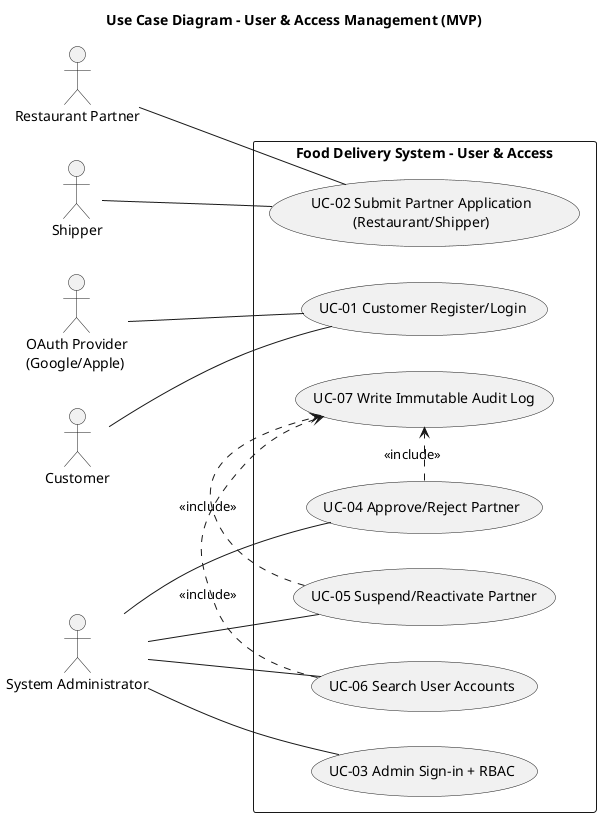
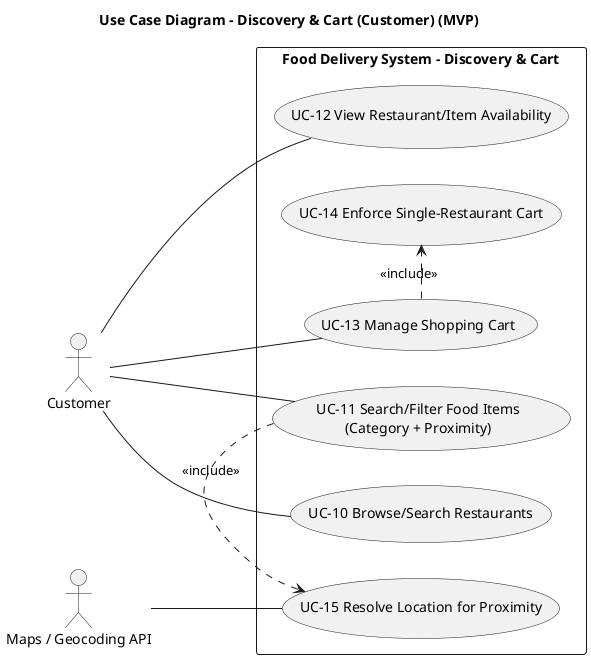
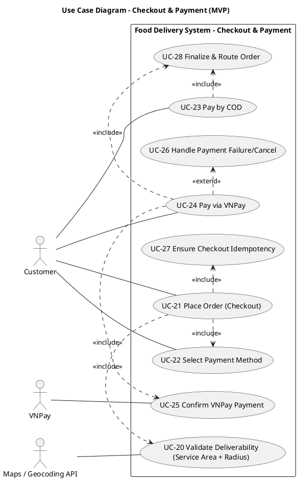
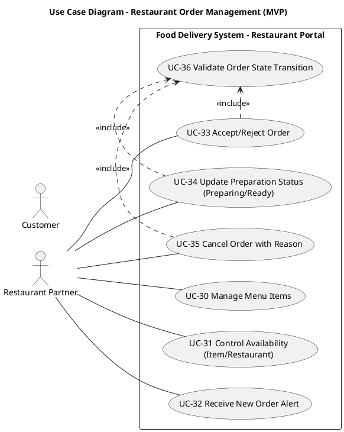
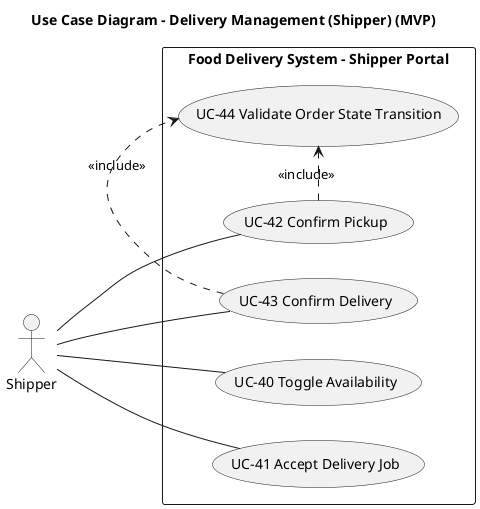
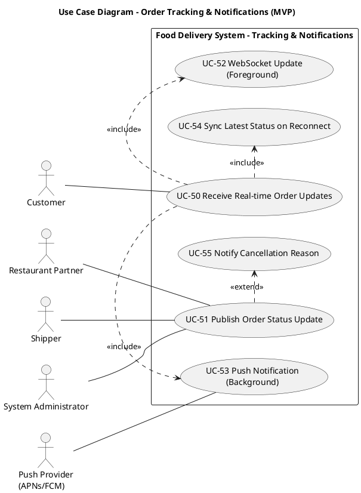
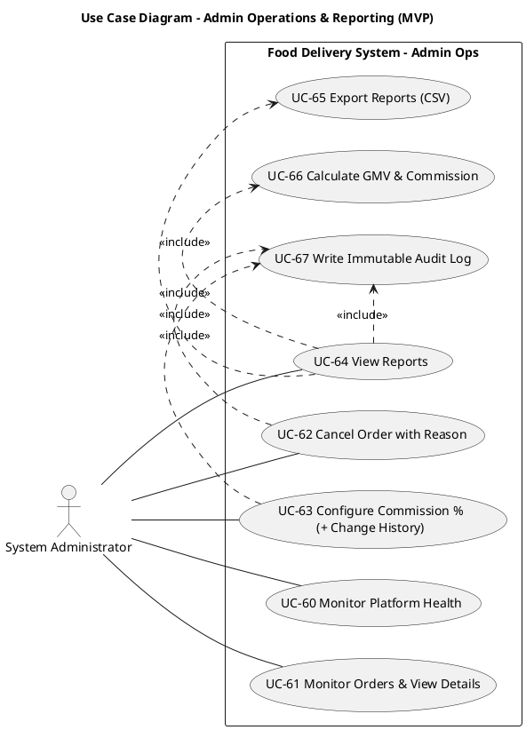

# Mô hình Use Case — Hệ thống Giao Đồ Ăn (Release 1 / MVP)

Version 1.0  
Ngày: 24/03/2026  
Nhóm thực hiện: Development Team

## Bảng ghi nhận thay đổi tài liệu

| Ngày | Phiên bản | Mô tả | Tác giả |
|---|---:|---|---|
| 24/03/2026 | 1.0 | Hoàn thành bản đầu tiên: sơ đồ use case theo miền nghiệp vụ, danh sách actor/use case, đặc tả use case MVP | Development Team |

## Mục lục

- [1. Sơ đồ Use-case](#1-sơ-đồ-use-case)
  - [1.1 Use-case Quản lý người dùng & truy cập](#11-use-case-quản-lý-người-dùng--truy-cập)
  - [1.2 Use-case Khám phá & giỏ hàng (Customer)](#12-use-case-khám-phá--giỏ-hàng-customer)
  - [1.3 Use-case Checkout & thanh toán](#13-use-case-checkout--thanh-toán)
  - [1.4 Use-case Quản lý đơn hàng phía Nhà hàng](#14-use-case-quản-lý-đơn-hàng-phía-nhà-hàng)
  - [1.5 Use-case Quản lý giao hàng (Shipper)](#15-use-case-quản-lý-giao-hàng-shipper)
  - [1.6 Use-case Theo dõi đơn & thông báo](#16-use-case-theo-dõi-đơn--thông-báo)
  - [1.7 Use-case Vận hành Admin & báo cáo](#17-use-case-vận-hành-admin--báo-cáo)
- [2. Danh sách các Actor](#2-danh-sách-các-actor)
- [3. Danh sách các Use-case](#3-danh-sách-các-use-case)
- [4. Đặc tả Use-case](#4-đặc-tả-use-case)

---

# 1. Sơ đồ Use-case

> Ghi chú: mỗi sơ đồ bên dưới tương ứng **một miền nghiệp vụ**. Mỗi PlantUML block là hợp lệ và runnable (`@startuml` → `@enduml`).

## 1.1 Use-case Quản lý người dùng & truy cập

## 1.2 Use-case Khám phá & giỏ hàng (Customer)

## 1.3 Use-case Checkout & thanh toán

## 1.4 Use-case Quản lý đơn hàng phía Nhà hàng

## 1.5 Use-case Quản lý giao hàng (Shipper)

## 1.6 Use-case Theo dõi đơn & thông báo

## 1.7 Use-case Vận hành Admin & báo cáo

---

# 2. Danh sách các Actor

| STT | Tên Actor | Ý nghĩa/Ghi chú |
|---:|---|---|
| 1 | Customer | Người dùng đặt món: tìm kiếm, thêm giỏ, checkout, theo dõi đơn. |
| 2 | Restaurant Partner | Nhà hàng/nhân viên bếp: quản lý menu, nhận & xử lý đơn, cập nhật trạng thái. |
| 3 | Shipper | Nhân viên giao hàng: bật/tắt sẵn sàng, nhận job, pickup, delivered. |
| 4 | System Administrator | Vận hành hệ thống: phê duyệt đối tác, giám sát, can thiệp hủy đơn, cấu hình commission, báo cáo, audit. |
| 5 | VNPay | Cổng thanh toán: xác nhận kết quả thanh toán online trước khi hệ thống finalize/routing (BR-4). |
| 6 | OAuth Provider (Google/Apple) | Nhà cung cấp đăng nhập OAuth cho luồng đăng nhập/đăng ký (SRS). |
| 7 | Maps/Geocoding API | Dịch vụ bản đồ/định vị: phục vụ proximity, kiểm tra bán kính giao, kiểm tra service area (Vision dependency). |
| 8 | Push Provider (APNs/FCM) | Dịch vụ push notification: gửi thông báo khi app background/closed (FR-2.3). |

---

# 3. Danh sách các Use-case

| STT | Use Case ID | Tên Use Case | Miền nghiệp vụ | Actor chính |
|---:|---|---|---|---|
| 1 | UC-01 | Customer Register/Login | User & Access | Customer, OAuth Provider |
| 2 | UC-02 | Submit Partner Application (Restaurant/Shipper) | User & Access | Restaurant Partner, Shipper |
| 3 | UC-03 | Admin Sign-in + RBAC | User & Access | System Administrator |
| 4 | UC-04 | Approve/Reject Partner | User & Access | System Administrator |
| 5 | UC-05 | Suspend/Reactivate Partner | User & Access | System Administrator |
| 6 | UC-06 | Search User Accounts | User & Access | System Administrator |
| 7 | UC-07 | Write Immutable Audit Log | User & Access / Admin Ops | System Administrator |
| 8 | UC-10 | Browse/Search Restaurants | Discovery & Cart | Customer |
| 9 | UC-11 | Search/Filter Food Items (Category + Proximity) | Discovery & Cart | Customer, Maps/Geocoding API |
| 10 | UC-12 | View Restaurant/Item Availability | Discovery & Cart | Customer |
| 11 | UC-13 | Manage Shopping Cart | Discovery & Cart | Customer |
| 12 | UC-14 | Enforce Single-Restaurant Cart | Discovery & Cart | Customer |
| 13 | UC-15 | Resolve Location for Proximity | Discovery & Cart | Customer, Maps/Geocoding API |
| 14 | UC-20 | Validate Deliverability (Service Area + Radius) | Checkout & Payment | Customer, Maps/Geocoding API |
| 15 | UC-21 | Place Order (Checkout) | Checkout & Payment | Customer |
| 16 | UC-22 | Select Payment Method | Checkout & Payment | Customer |
| 17 | UC-23 | Pay by COD | Checkout & Payment | Customer |
| 18 | UC-24 | Pay via VNPay | Checkout & Payment | Customer, VNPay |
| 19 | UC-25 | Confirm VNPay Payment | Checkout & Payment | VNPay |
| 20 | UC-26 | Handle Payment Failure/Cancel | Checkout & Payment | Customer |
| 21 | UC-27 | Ensure Checkout Idempotency | Checkout & Payment | Customer |
| 22 | UC-28 | Finalize & Route Order | Checkout & Payment | System |
| 23 | UC-30 | Manage Menu Items | Restaurant Order Mgmt | Restaurant Partner |
| 24 | UC-31 | Control Availability (Item/Restaurant) | Restaurant Order Mgmt | Restaurant Partner |
| 25 | UC-32 | Receive New Order Alert | Restaurant Order Mgmt | Restaurant Partner |
| 26 | UC-33 | Accept/Reject Order | Restaurant Order Mgmt | Restaurant Partner |
| 27 | UC-34 | Update Preparation Status | Restaurant Order Mgmt | Restaurant Partner |
| 28 | UC-35 | Cancel Order with Reason (Restaurant) | Restaurant Order Mgmt | Restaurant Partner |
| 29 | UC-36 | Validate Order State Transition (Restaurant) | Restaurant Order Mgmt | System |
| 30 | UC-40 | Toggle Availability | Delivery Mgmt | Shipper |
| 31 | UC-41 | Accept Delivery Job | Delivery Mgmt | Shipper |
| 32 | UC-42 | Confirm Pickup | Delivery Mgmt | Shipper |
| 33 | UC-43 | Confirm Delivery | Delivery Mgmt | Shipper |
| 34 | UC-44 | Validate Order State Transition (Shipper) | Delivery Mgmt | System |
| 35 | UC-50 | Receive Real-time Order Updates | Tracking & Notifications | Customer |
| 36 | UC-51 | Publish Order Status Update | Tracking & Notifications | Restaurant Partner, Shipper, Admin |
| 37 | UC-52 | WebSocket Update (Foreground) | Tracking & Notifications | System |
| 38 | UC-53 | Push Notification (Background) | Tracking & Notifications | Push Provider |
| 39 | UC-54 | Sync Latest Status on Reconnect | Tracking & Notifications | Customer |
| 40 | UC-55 | Notify Cancellation Reason | Tracking & Notifications | System |
| 41 | UC-60 | Monitor Platform Health | Admin Ops | System Administrator |
| 42 | UC-61 | Monitor Orders & View Details | Admin Ops | System Administrator |
| 43 | UC-62 | Cancel Order with Reason (Admin) | Admin Ops | System Administrator |
| 44 | UC-63 | Configure Commission % (+ History) | Admin Ops | System Administrator |
| 45 | UC-64 | View Reports | Admin Ops | System Administrator |
| 46 | UC-65 | Export Reports (CSV) | Admin Ops | System Administrator |
| 47 | UC-66 | Calculate GMV & Commission | Admin Ops | System |
| 48 | UC-67 | Write Immutable Audit Log (Admin Ops) | Admin Ops | System Administrator |

---

# 4. Đặc tả Use-case

> Mỗi đặc tả bên dưới bám theo Business Rules (BR-1..BR-9), SRS (FR-1.x..FR-4.x), và các User Stories (US-1..US-32).

## 4.1 UC-01 — Customer Register/Login

|  |  |
|---|---|
| Use Case ID | UC-01 |
| Tên Use Case | Customer Register/Login |
| Actor | Customer; OAuth Provider (Google/Apple) |
| Mô tả | Cho phép Customer đăng ký/đăng nhập để sử dụng các chức năng đặt món và theo dõi đơn. |
| Điều kiện tiên quyết | Customer có kết nối mạng; hệ thống sẵn sàng tiếp nhận yêu cầu xác thực. |
| Kết quả sau cùng | Customer đăng nhập thành công và có phiên hoạt động hợp lệ; hoặc nhận thông báo lỗi an toàn. |
| Mức độ ưu tiên | Cao (MVP) |
| Tần suất sử dụng | Hàng ngày |
| Luồng sự kiện chính | 1) Customer mở app và chọn đăng ký/đăng nhập. 2) Customer nhập thông tin hoặc chọn OAuth. 3) Hệ thống xác thực (qua OAuth nếu có). 4) Hệ thống tạo/khôi phục hồ sơ người dùng. 5) Hệ thống trả về trạng thái đăng nhập thành công. |
| Luồng thay thế | A1) Sai thông tin đăng nhập → hệ thống từ chối và hiển thị lỗi không lộ thông tin nhạy cảm. A2) OAuth thất bại → hiển thị lỗi và cho phép thử lại. |
| Ngoại lệ | E1) Dịch vụ auth không sẵn sàng → hiển thị lỗi có thể retry, app không crash. |
| Bao gồm | (nếu dùng OAuth) Xác thực qua OAuth Provider |
| Mở rộng | Không |
| Yêu cầu đặc biệt | Không lộ thông tin nhạy cảm trong thông báo lỗi; tuân thủ bảo mật xác thực. |
| Giả định | Customer cung cấp thông tin hợp lệ. |
| Ghi chú & Vấn đề | Là nền tảng cho quyền truy cập theo vai trò (Admin/Partner). |

## 4.2 UC-02 — Submit Partner Application (Restaurant/Shipper)

|  |  |
|---|---|
| Use Case ID | UC-02 |
| Tên Use Case | Submit Partner Application (Restaurant/Shipper) |
| Actor | Restaurant Partner; Shipper |
| Mô tả | Cho phép Restaurant Partner/Shipper gửi hồ sơ đăng ký tham gia hệ thống để chờ Admin phê duyệt (BR-1). |
| Điều kiện tiên quyết | Người dùng chưa được phê duyệt; có kết nối mạng. |
| Kết quả sau cùng | Hồ sơ được tạo với trạng thái `Pending Approval`. |
| Mức độ ưu tiên | Cao (MVP) |
| Tần suất sử dụng | Thỉnh thoảng |
| Luồng sự kiện chính | 1) Partner chọn đăng ký. 2) Nhập thông tin cần thiết. 3) Hệ thống validate dữ liệu. 4) Hệ thống lưu hồ sơ ở trạng thái chờ duyệt. 5) Thông báo gửi thành công. |
| Luồng thay thế | Dữ liệu không hợp lệ → hiển thị lỗi theo trường. |
| Ngoại lệ | Lỗi hệ thống/kết nối → không tạo hồ sơ; hiển thị lỗi retry. |
| Bao gồm | Validate dữ liệu hồ sơ |
| Mở rộng | Không |
| Yêu cầu đặc biệt | Trạng thái phải phù hợp BR-1 và hiển thị được trong hàng đợi duyệt của Admin. |
| Giả định | Admin sẽ duyệt thủ công. |
| Ghi chú & Vấn đề | Chi tiết trường dữ liệu sẽ xác định theo UI/UX và yêu cầu vận hành. |

## 4.3 UC-03 — Admin Sign-in + RBAC

|  |  |
|---|---|
| Use Case ID | UC-03 |
| Tên Use Case | Admin Sign-in + RBAC |
| Actor | System Administrator |
| Mô tả | Cho phép Admin truy cập dashboard và hệ thống áp dụng RBAC cho mọi thao tác quản trị (FR-4.1, FR-4.2). |
| Điều kiện tiên quyết | Admin có tài khoản hợp lệ. |
| Kết quả sau cùng | Admin đăng nhập thành công; các thao tác bị chặn nếu không đủ quyền. |
| Mức độ ưu tiên | Cao (MVP) |
| Tần suất sử dụng | Hàng ngày |
| Luồng sự kiện chính | 1) Admin truy cập dashboard. 2) Hệ thống yêu cầu đăng nhập. 3) Admin xác thực. 4) Hệ thống tạo session và tải quyền (roles/permissions). 5) Admin truy cập các màn hình được phép. |
| Luồng thay thế | Sai thông tin → từ chối và log sự kiện. |
| Ngoại lệ | Lỗi auth → hiển thị lỗi retry. |
| Bao gồm | Kiểm tra quyền (RBAC) cho từng hành động |
| Mở rộng | Không |
| Yêu cầu đặc biệt | Ghi nhận các lần truy cập bị từ chối để điều tra. |
| Giả định | Danh sách quyền đã được cấu hình. |
| Ghi chú & Vấn đề | Là tiền đề cho toàn bộ module Admin. |

## 4.4 UC-04 — Approve/Reject Partner

|  |  |
|---|---|
| Use Case ID | UC-04 |
| Tên Use Case | Approve/Reject Partner |
| Actor | System Administrator |
| Mô tả | Admin duyệt hoặc từ chối hồ sơ Restaurant/Shipper để đảm bảo tin cậy thị trường (BR-1; FR-4.4..FR-4.7). |
| Điều kiện tiên quyết | Admin đã đăng nhập; tồn tại hồ sơ `Pending Approval`. |
| Kết quả sau cùng | Hồ sơ chuyển `Active/Approved` hoặc `Rejected` và người nộp nhận kết quả. |
| Mức độ ưu tiên | Cao (MVP) |
| Tần suất sử dụng | Hàng ngày (giai đoạn đầu) |
| Luồng sự kiện chính | 1) Admin mở hàng đợi hồ sơ chờ duyệt. 2) Chọn 1 hồ sơ. 3) Xem thông tin. 4) Chọn Approve hoặc Reject. 5) Nếu Reject, nhập lý do bắt buộc. 6) Hệ thống lưu quyết định và cập nhật trạng thái. |
| Luồng thay thế | Không đủ quyền → hệ thống từ chối. |
| Ngoại lệ | Lỗi lưu quyết định → hiển thị lỗi; không thay đổi trạng thái. |
| Bao gồm | UC-07 Write Immutable Audit Log |
| Mở rộng | Thông báo kết quả đến applicant |
| Yêu cầu đặc biệt | Lý do từ chối phải được lưu để giảm support tickets. |
| Giả định | Quy trình duyệt thủ công. |
| Ghi chú & Vấn đề | Có thể bổ sung checklist duyệt trong các release sau. |

## 4.5 UC-05 — Suspend/Reactivate Partner

|  |  |
|---|---|
| Use Case ID | UC-05 |
| Tên Use Case | Suspend/Reactivate Partner |
| Actor | System Administrator |
| Mô tả | Admin tạm khóa/mở lại tài khoản đối tác để ngăn vận hành khi vi phạm (FR-4.8, FR-4.9). |
| Điều kiện tiên quyết | Admin đã đăng nhập; partner đã tồn tại và có trạng thái phù hợp. |
| Kết quả sau cùng | Partner bị `Suspended` hoặc trở lại `Active`; hệ thống chặn/cho phép nhận đơn tương ứng. |
| Mức độ ưu tiên | Trung bình - Cao |
| Tần suất sử dụng | Thỉnh thoảng |
| Luồng sự kiện chính | 1) Admin tìm partner. 2) Chọn Suspend/Reactivate. 3) Nếu Suspend, nhập lý do. 4) Hệ thống lưu thay đổi trạng thái và áp chính sách chặn nhận/xử lý đơn. |
| Luồng thay thế | Không đủ quyền → từ chối. |
| Ngoại lệ | Lỗi lưu → không đổi trạng thái. |
| Bao gồm | UC-07 Write Immutable Audit Log |
| Mở rộng | Không |
| Yêu cầu đặc biệt | Lý do suspension cần lưu để điều tra. |
| Giả định | Hệ thống enforce trạng thái ở các luồng nhận đơn/dispatch. |
| Ghi chú & Vấn đề | Chính sách ảnh hưởng đơn đang xử lý cần quy định rõ. |

## 4.6 UC-06 — Search User Accounts

|  |  |
|---|---|
| Use Case ID | UC-06 |
| Tên Use Case | Search User Accounts |
| Actor | System Administrator |
| Mô tả | Admin lọc/tìm user theo role và status để vận hành hiệu quả (FR-4.3). |
| Điều kiện tiên quyết | Admin đã đăng nhập. |
| Kết quả sau cùng | Danh sách user trả về đúng theo filter/search. |
| Mức độ ưu tiên | Trung bình |
| Tần suất sử dụng | Hàng ngày |
| Luồng sự kiện chính | 1) Admin vào màn hình User Management. 2) Chọn filter role/status, nhập từ khóa (nếu có). 3) Hệ thống truy vấn và trả danh sách. 4) Admin mở chi tiết user. |
| Luồng thay thế | Không có kết quả → hiển thị danh sách rỗng. |
| Ngoại lệ | Lỗi truy vấn → hiển thị lỗi retry. |
| Bao gồm | UC-07 Write Immutable Audit Log |
| Mở rộng | Không |
| Yêu cầu đặc biệt | p95 truy vấn phổ biến nên đáp ứng trong ngưỡng hợp lý để không thành nút thắt vận hành. |
| Giả định | Có index/filter phía backend. |
| Ghi chú & Vấn đề | Các trường tìm kiếm cụ thể sẽ chốt theo UI. |

## 4.7 UC-10 — Browse/Search Restaurants

|  |  |
|---|---|
| Use Case ID | UC-10 |
| Tên Use Case | Browse/Search Restaurants |
| Actor | Customer |
| Mô tả | Customer xem danh sách nhà hàng và tìm kiếm theo tên/category/proximity (FR-1.2). |
| Điều kiện tiên quyết | Có dữ liệu nhà hàng đã được duyệt và đang active. |
| Kết quả sau cùng | Customer thấy danh sách kết quả và có thể mở trang chi tiết nhà hàng. |
| Mức độ ưu tiên | Cao (MVP) |
| Tần suất sử dụng | Hàng ngày |
| Luồng sự kiện chính | 1) Customer mở danh sách nhà hàng. 2) Hệ thống tải trang đầu. 3) Customer nhập từ khóa/chọn filter. 4) Hệ thống trả kết quả. 5) Customer chọn 1 nhà hàng để xem menu. |
| Luồng thay thế | Danh sách lớn → hệ thống phân trang/scroll load. |
| Ngoại lệ | Lỗi tải dữ liệu → hiển thị lỗi retry. |
| Bao gồm | Không |
| Mở rộng | Không |
| Yêu cầu đặc biệt | Trang đầu nên render trong ngưỡng mục tiêu (tham chiếu US-2). |
| Giả định | Có cơ chế cache/index phục vụ tìm kiếm. |
| Ghi chú & Vấn đề | Cần đồng bộ trạng thái active/closed của nhà hàng. |

## 4.8 UC-11 — Search/Filter Food Items (Category + Proximity)

|  |  |
|---|---|
| Use Case ID | UC-11 |
| Tên Use Case | Search/Filter Food Items (Category + Proximity) |
| Actor | Customer; Maps/Geocoding API |
| Mô tả | Cho phép Customer tìm món theo keyword/category và lọc theo khoảng cách phục vụ (US-3; BR-3). |
| Điều kiện tiên quyết | Customer cung cấp vị trí (GPS hoặc địa chỉ). |
| Kết quả sau cùng | Danh sách món phù hợp và thuộc các nhà hàng có thể giao tới vị trí hiện tại. |
| Mức độ ưu tiên | Trung bình (Should) |
| Tần suất sử dụng | Hàng ngày |
| Luồng sự kiện chính | 1) Customer mở item search. 2) Hệ thống lấy vị trí. 3) Customer nhập keyword/chọn category. 4) Hệ thống truy vấn và lọc theo proximity. 5) Hiển thị kết quả và cho phép mở nhà hàng sở hữu món. |
| Luồng thay thế | Không có quyền GPS → yêu cầu nhập địa chỉ. |
| Ngoại lệ | Lỗi map/geocode → hiển thị lỗi và cho retry. |
| Bao gồm | UC-15 Resolve Location for Proximity |
| Mở rộng | Không |
| Yêu cầu đặc biệt | p95 phản hồi mục tiêu tham chiếu US-3 (cấu hình được). |
| Giả định | Có dữ liệu menu/cửa hàng cập nhật. |
| Ghi chú & Vấn đề | Luồng này phải tôn trọng BR-2 (cart 1 nhà hàng). |

## 4.9 UC-13 — Manage Shopping Cart

|  |  |
|---|---|
| Use Case ID | UC-13 |
| Tên Use Case | Manage Shopping Cart |
| Actor | Customer |
| Mô tả | Cho phép Customer thêm/xóa món, đổi số lượng và xem tổng tiền trước checkout (US-22). |
| Điều kiện tiên quyết | Customer đã chọn nhà hàng và xem menu. |
| Kết quả sau cùng | Giỏ hàng cập nhật đúng; tổng tiền nhất quán. |
| Mức độ ưu tiên | Cao (MVP) |
| Tần suất sử dụng | Hàng ngày |
| Luồng sự kiện chính | 1) Customer thêm món vào giỏ với số lượng. 2) Hệ thống cập nhật giỏ và tính tổng. 3) Customer tăng/giảm số lượng hoặc xóa món. 4) Hệ thống cập nhật ngay. |
| Luồng thay thế | Customer đóng/mở lại app → giỏ được khôi phục trong cửa sổ lưu trữ hoặc được reset có thông báo rõ ràng. |
| Ngoại lệ | Lỗi lưu giỏ → hiển thị lỗi retry. |
| Bao gồm | UC-14 Enforce Single-Restaurant Cart |
| Mở rộng | Không |
| Yêu cầu đặc biệt | Thao tác giỏ phải phản hồi nhanh trên mobile (tham chiếu US-22). |
| Giả định | Menu/giá được đồng bộ. |
| Ghi chú & Vấn đề | Cần xử lý trường hợp món bị sold out sau khi đã vào giỏ. |

## 4.10 UC-20 — Validate Deliverability (Service Area + Radius)

|  |  |
|---|---|
| Use Case ID | UC-20 |
| Tên Use Case | Validate Deliverability (Service Area + Radius) |
| Actor | Customer; Maps/Geocoding API |
| Mô tả | Xác nhận địa chỉ giao nằm trong service area (BR-6) và trong bán kính phục vụ của nhà hàng (BR-3) trước khi đặt đơn. |
| Điều kiện tiên quyết | Customer có địa chỉ giao; nhà hàng có cấu hình radius. |
| Kết quả sau cùng | Cho phép tiếp tục checkout hoặc chặn với lý do cụ thể. |
| Mức độ ưu tiên | Cao (MVP) |
| Tần suất sử dụng | Hàng ngày |
| Luồng sự kiện chính | 1) Customer nhập/chọn địa chỉ giao. 2) Hệ thống geocode địa chỉ. 3) Hệ thống kiểm tra thuộc service area. 4) Hệ thống tính khoảng cách đến nhà hàng và so với radius. 5) Trả kết quả pass/fail kèm lý do. |
| Luồng thay thế | Không có GPS → dùng địa chỉ nhập tay. |
| Ngoại lệ | Map/geocode lỗi → hiển thị lỗi retry; không cho đặt đơn nếu chưa validate. |
| Bao gồm | Không |
| Mở rộng | Không |
| Yêu cầu đặc biệt | Lý do chặn phải rõ ràng để tránh lặp lại thao tác. |
| Giả định | Service area được cấu hình; radius nhà hàng chính xác. |
| Ghi chú & Vấn đề | Có thể cache kết quả trong thời gian ngắn để giảm gọi API. |

## 4.11 UC-21 — Place Order (Checkout)

|  |  |
|---|---|
| Use Case ID | UC-21 |
| Tên Use Case | Place Order (Checkout) |
| Actor | Customer |
| Mô tả | Customer đặt đơn: validate deliverability, chọn payment, đảm bảo idempotency và chuyển sang finalize/routing theo BR-4. |
| Điều kiện tiên quyết | Giỏ hàng hợp lệ (1 nhà hàng); địa chỉ giao hợp lệ. |
| Kết quả sau cùng | Đơn được finalize và routed (COD) hoặc finalize sau khi VNPay confirm; nếu thất bại hiển thị trạng thái phù hợp. |
| Mức độ ưu tiên | Cao (MVP) |
| Tần suất sử dụng | Hàng ngày |
| Luồng sự kiện chính | 1) Customer vào checkout. 2) Hệ thống gọi UC-20. 3) Customer chọn UC-22. 4) Hệ thống đảm bảo UC-27. 5) Nếu COD → UC-23 và UC-28. 6) Nếu VNPay → UC-24 (sau confirm sẽ UC-28). |
| Luồng thay thế | Retry cùng idempotency key trong TTL → trả về cùng order ID, không tạo trùng. |
| Ngoại lệ | Không đạt deliverability → chặn và thông báo lý do. |
| Bao gồm | UC-20; UC-22; UC-27 |
| Mở rộng | Không |
| Yêu cầu đặc biệt | BR-4: VNPay chỉ finalize/routing sau khi confirm thành công. |
| Giả định | Cổng VNPay hoạt động (nếu chọn VNPay). |
| Ghi chú & Vấn đề | Trạng thái payment failed/cancelled cần rõ ràng cho Customer. |

## 4.12 UC-24 — Pay via VNPay

|  |  |
|---|---|
| Use Case ID | UC-24 |
| Tên Use Case | Pay via VNPay |
| Actor | Customer; VNPay |
| Mô tả | Khởi tạo luồng thanh toán VNPay và chờ xác nhận thành công trước khi finalize/routing (BR-4). |
| Điều kiện tiên quyết | Customer chọn VNPay; đơn ở trạng thái chờ thanh toán. |
| Kết quả sau cùng | Thanh toán thành công → UC-28; thất bại/hủy → UC-26. |
| Mức độ ưu tiên | Cao (MVP) |
| Tần suất sử dụng | Hàng ngày |
| Luồng sự kiện chính | 1) Customer xác nhận thanh toán. 2) Hệ thống tạo yêu cầu đến VNPay. 3) Customer hoàn tất trên VNPay. 4) VNPay gọi back/redirect về hệ thống. 5) Hệ thống thực hiện UC-25. 6) Nếu success → UC-28. |
| Luồng thay thế | Customer hủy giữa chừng → UC-26. |
| Ngoại lệ | Callback không hợp lệ → đánh dấu thất bại và không routing. |
| Bao gồm | UC-25 Confirm VNPay Payment; UC-28 Finalize & Route Order |
| Mở rộng | UC-26 Handle Payment Failure/Cancel |
| Yêu cầu đặc biệt | Bảo mật callback và đối soát kết quả theo chuẩn VNPay. |
| Giả định | VNPay uptime đạt cam kết (Vision dependency). |
| Ghi chú & Vấn đề | Cần sandbox test trước khi go-live. |

## 4.13 UC-33 — Accept/Reject Order (Restaurant)

|  |  |
|---|---|
| Use Case ID | UC-33 |
| Tên Use Case | Accept/Reject Order |
| Actor | Restaurant Partner |
| Mô tả | Nhà hàng nhận đơn mới, xem chi tiết và accept/reject; có timeout tự động hết hạn (US-13). |
| Điều kiện tiên quyết | Nhà hàng đã được duyệt; có đơn routed tới nhà hàng. |
| Kết quả sau cùng | Accept → trạng thái `Accepted` và hệ thống phát cập nhật; Reject/timeout → đơn bị từ chối/hết hạn và Customer nhận lý do. |
| Mức độ ưu tiên | Cao (MVP) |
| Tần suất sử dụng | Hàng ngày |
| Luồng sự kiện chính | 1) Hệ thống phát UC-32 (alert). 2) Nhà hàng mở đơn. 3) Chọn Accept hoặc Reject. 4) Hệ thống validate state transition (UC-36). 5) Hệ thống cập nhật trạng thái và lưu. |
| Luồng thay thế | Quá thời gian `RESTAURANT_ACCEPT_TIMEOUT_SECONDS` → hệ thống đánh dấu Expired và thông báo cho Customer. |
| Ngoại lệ | Lỗi cập nhật trạng thái → hiển thị lỗi retry; không đổi trạng thái. |
| Bao gồm | UC-36 Validate Order State Transition |
| Mở rộng | Không |
| Yêu cầu đặc biệt | Alert phải rõ ràng trong môi trường bếp (FR-3.3). |
| Giả định | Nhà hàng online/thiết bị nhận được alert. |
| Ghi chú & Vấn đề | Cần quy định reason code cho timeout/reject. |

## 4.14 UC-42 — Confirm Pickup (Shipper)

|  |  |
|---|---|
| Use Case ID | UC-42 |
| Tên Use Case | Confirm Pickup |
| Actor | Shipper |
| Mô tả | Shipper xác nhận đã pickup đơn tại nhà hàng và chuyển trạng thái theo BR-7 (US-16). |
| Điều kiện tiên quyết | Shipper được assign; đơn ở trạng thái phù hợp (Ready/Pickup). |
| Kết quả sau cùng | Đơn chuyển sang `Picked Up` và được publish cập nhật. |
| Mức độ ưu tiên | Cao (MVP) |
| Tần suất sử dụng | Hàng ngày |
| Luồng sự kiện chính | 1) Shipper mở job đang giao. 2) Tại nhà hàng, chọn Confirm Pickup. 3) Hệ thống validate transition (UC-44). 4) Hệ thống cập nhật trạng thái. |
| Luồng thay thế | Mất kết nối → hiển thị lỗi retry, không đổi trạng thái. |
| Ngoại lệ | Trạng thái không hợp lệ → từ chối và hiển thị lý do. |
| Bao gồm | UC-44 Validate Order State Transition |
| Mở rộng | Không |
| Yêu cầu đặc biệt | Chỉ shipper được assign mới có quyền cập nhật. |
| Giả định | Cơ chế assign/lock đơn hoạt động đúng. |
| Ghi chú & Vấn đề | Cần audit trail cho hành động shipper. |

## 4.15 UC-50 — Receive Real-time Order Updates

|  |  |
|---|---|
| Use Case ID | UC-50 |
| Tên Use Case | Receive Real-time Order Updates |
| Actor | Customer; Push Provider (APNs/FCM) |
| Mô tả | Customer nhận cập nhật trạng thái đơn theo thời gian thực qua WebSocket hoặc Push khi app nền (FR-2.1..FR-2.4). |
| Điều kiện tiên quyết | Customer có đơn đang theo dõi; có kết nối mạng (hoặc push token hợp lệ). |
| Kết quả sau cùng | App hiển thị trạng thái mới nhất; có cơ chế sync khi reconnect. |
| Mức độ ưu tiên | Cao (MVP) |
| Tần suất sử dụng | Hàng ngày |
| Luồng sự kiện chính | 1) Khi trạng thái đơn đổi, hệ thống publish event (UC-51). 2) App foreground nhận WebSocket (UC-52). 3) App background nhận push (UC-53). 4) Nếu reconnect, app sync (UC-54). |
| Luồng thay thế | Provider degraded → fallback polling (theo US-9). |
| Ngoại lệ | Push/WebSocket lỗi → app không crash; retry/sync lại khi có mạng. |
| Bao gồm | UC-52; UC-53; UC-54 |
| Mở rộng | UC-55 Notify Cancellation Reason |
| Yêu cầu đặc biệt | SLA cập nhật mục tiêu theo US-9 (cấu hình). |
| Giả định | Push token hợp lệ; WebSocket infra sẵn sàng. |
| Ghi chú & Vấn đề | Full GPS live tracking deferred; MVP là status updates. |

## 4.16 UC-64 — View Reports

|  |  |
|---|---|
| Use Case ID | UC-64 |
| Tên Use Case | View Reports |
| Actor | System Administrator |
| Mô tả | Admin xem báo cáo: order volume, financial/commission summary, user approval status (SRS Reports; FR-4.15). |
| Điều kiện tiên quyết | Admin đã đăng nhập và có quyền. |
| Kết quả sau cùng | Báo cáo hiển thị theo filter; có thể export CSV. |
| Mức độ ưu tiên | Trung bình (Could) |
| Tần suất sử dụng | Hàng tuần / Hàng ngày (tùy vận hành) |
| Luồng sự kiện chính | 1) Admin mở Reports. 2) Chọn loại báo cáo và filter (date range, restaurant,...). 3) Hệ thống tính toán dữ liệu (UC-66). 4) Hiển thị kết quả. 5) Admin export (UC-65) nếu cần. |
| Luồng thay thế | Không có dữ liệu → hiển thị rỗng. |
| Ngoại lệ | Lỗi truy vấn/tính toán → hiển thị lỗi retry. |
| Bao gồm | UC-65 Export Reports; UC-66 Calculate GMV & Commission |
| Mở rộng | Không |
| Yêu cầu đặc biệt | Export phải có header ổn định để đối soát (US-31). |
| Giả định | Dữ liệu đơn và thanh toán đã đầy đủ. |
| Ghi chú & Vấn đề | MVP báo cáo “lightweight”, không BI nâng cao. |

---

## File PlantUML thuần (khuyến nghị)

Ngoài các block PlantUML trong file này, các sơ đồ cũng được lưu ở dạng `.puml` để render/paste nhanh trong PlantUML Web Editor.
